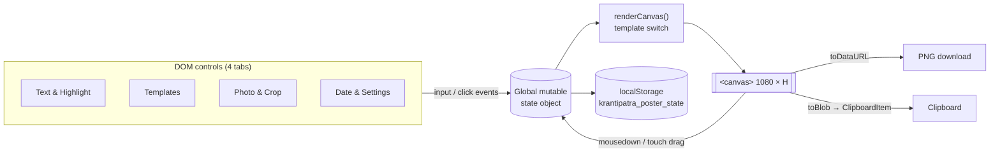
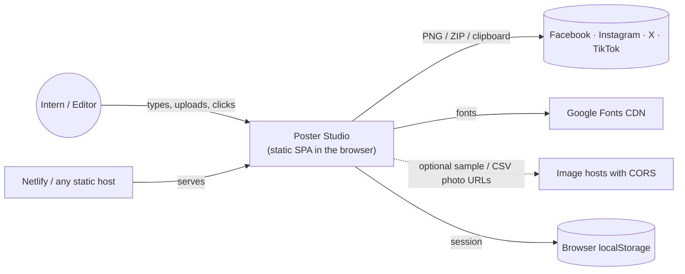
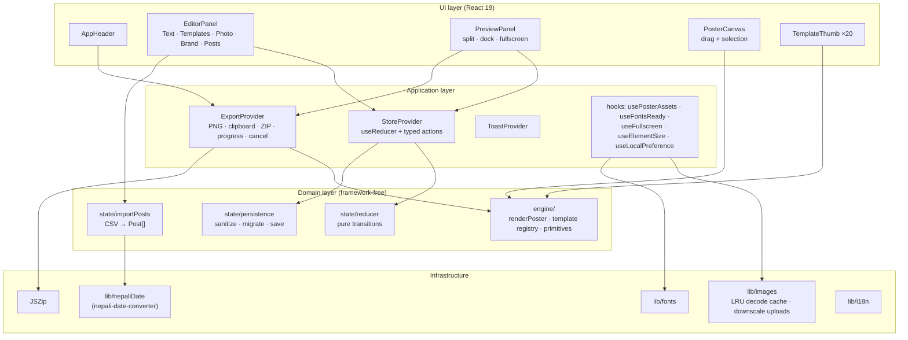
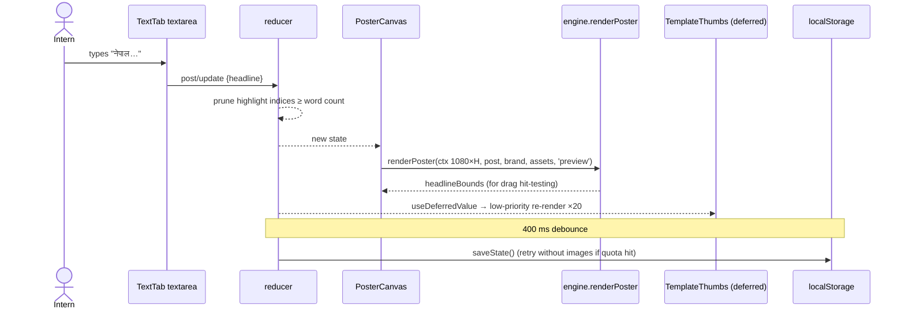
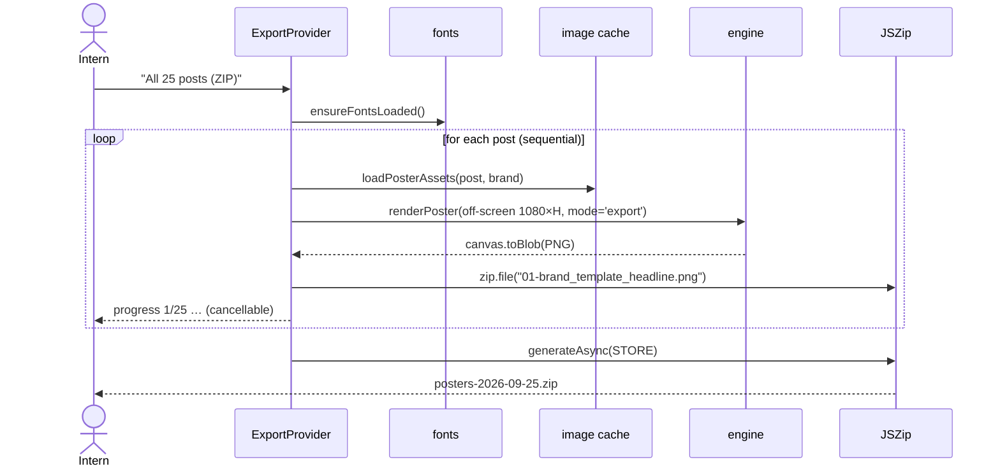
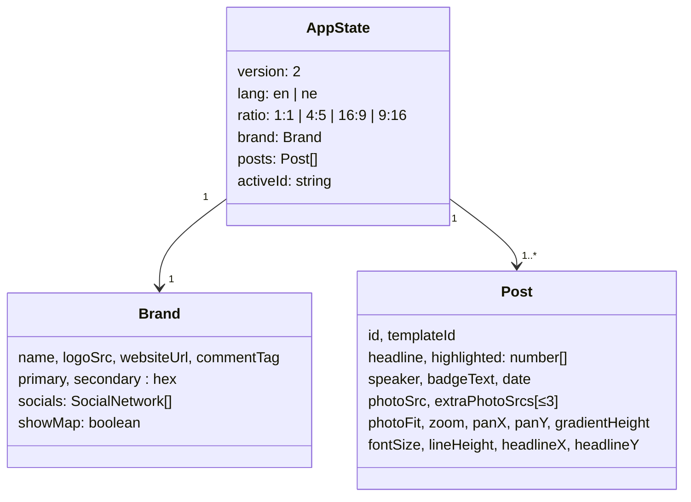

# Poster Studio: Proposal & System Architecture

> **Project:** Poster Studio, a bulk news-poster generator for Facebook, Instagram & other social platforms
> **Reference system:** [krantipatra.netlify.app](https://krantipatra.netlify.app) (KrantiPatra Poster & News Maker)
> **Repository:** `sangit-pokhrel/Poster-template`
> **Status:** v1.0 implemented · **Date:** 25 September 2026 (९ आश्विन २०८३)

---

## Table of contents

1. [Executive summary](#1-executive-summary)
2. [Problem statement](#2-problem-statement)
3. [Goals & non-goals](#3-goals--non-goals)
4. [Analysis of the reference system (krantipatra.netlify.app)](#4-analysis-of-the-reference-system)
5. [Requirements](#5-requirements)
6. [User experience design](#6-user-experience-design)
7. [System architecture](#7-system-architecture)
8. [Rendering engine](#8-rendering-engine)
9. [Template catalogue (20)](#9-template-catalogue)
10. [Data model & state](#10-data-model--state)
11. [Bulk workflow: CSV in, ZIP out](#11-bulk-workflow)
12. [Cross-cutting concerns](#12-cross-cutting-concerns)
13. [Deviations from the reference (and why)](#13-deviations-from-the-reference)
14. [Quality strategy](#14-quality-strategy)
15. [Deployment & operations](#15-deployment--operations)
16. [Roadmap](#16-roadmap)
17. [Risks & mitigations](#17-risks--mitigations)
18. [Appendix](#18-appendix)

---

## 1. Executive summary

Interns currently spend most of their time hand-making news posters. Poster Studio turns that into a form-filling task: **type the headline, pick words to highlight, drop in a photo, choose one of 20 templates, download.** For volume days, they can **import a CSV of stories and download every poster as one ZIP.**

The tool reproduces the **exact rendering logic** of the KrantiPatra poster maker (a single HTML5 Canvas 2D pipeline, the same layout constants and the same shared chrome of logo, date, red/blue dual bar and social footer). It re-engineers that logic as a typed, tested and framework-independent engine so that one code path can drive the live preview, the template thumbnails and batch export.

| | Reference (krantipatra) | Poster Studio |
|---|---|---|
| Templates | 13 | **20** (13 faithful ports + 7 new) |
| Posters per session | 1 | **Unlimited posts, each with its own template** |
| Bulk | none | **CSV import → ZIP export**, "1 post × 20 templates" ZIP |
| Workspace | fixed 480 px sidebar + preview | **50 / 50 split**, **minimise-to-dock**, **full-screen** preview |
| Brand | hard-coded logo & colours | **Brand kit**: logo, name, URL, call-out, 2 colours, social icons |
| Date | approximate BS formula | **Exact Bikram Sambat** (lookup-table converter) |
| Code | 2,435-line single `app.js` | TypeScript, 46 modules, strict mode, unit + browser tests |

---

## 2. Problem statement

- **Time:** one poster takes 10–20 minutes in a general design tool. A news desk publishes 10–40 posts a day.
- **Consistency:** posters made by different interns drift in fonts, logo placement, colours and date formats.
- **Skills:** interns are content people, not designers. They should fill in facts, not push pixels.
- **Nepali typography:** Devanagari needs correct fonts and word-level highlighting, which generic template sites handle poorly.

The reference tool solved *consistency* and *skills* for one poster at a time. Poster Studio keeps that and adds *throughput*.

---

## 3. Goals & non-goals

**Goals**

1. Every element found on a typical FB/IG news promo poster is editable from a form: logo, date, headline with highlighted words, speaker, badge label, call-out, website, social icons, photos, colours, background texture.
2. **Half the screen is the editor and half is the live poster**, pixel-identical to the downloaded file. The preview can be **minimised** or made **full screen**.
3. **20 visually distinct templates** that share one brand grammar.
4. **Bulk:** many posts per session, CSV import, one-click ZIP.
5. Rendering behaviour **faithful to krantipatra.netlify.app**.
6. Production-quality engineering: typed, tested, accessible, no backend required.

**Non-goals (v1)**

- User accounts, cloud storage, multi-user collaboration (see [Roadmap](#16-roadmap)).
- Free-form canvas design (Canva-style). Templates are intentionally constrained.
- Video / animated posts.

---

## 4. Analysis of the reference system

The reference site was analysed from its shipped source (`index.html`, `style.css`, `app.js`, 2,435 lines, vanilla JS, no framework, no build step).

### 4.1 Architecture of the reference



### 4.2 The core logic (what "exact logic" means)

| # | Mechanism | How the reference does it | Kept in Poster Studio |
|---|---|---|---|
| 1 | **Render target** | One `<canvas>`; width always **1080**; height by ratio: 1:1 → 1080, 4:5 → 1350, 16:9 → 608, 9:16 → 1920 | ✅ identical sizes |
| 2 | **Render loop** | Every input mutates `state` → `renderCanvas()` → `saveToStorage()` | ✅ state change → repaint → debounced save |
| 3 | **Template router** | `switch (state.template)` → one `renderXTemplate(ctx, w, h)` per template; canvas cleared to white first | ✅ registry lookup → `template.render(scene)`; white clear first |
| 4 | **Compact rule** | `isCompact = height <= 700` (16:9 banner) tightens bars, logo and photo ratios | ✅ `scene.isCompact` |
| 5 | **Photo layer** | `drawPhotoLayer(heightRatio, centerRatio, rect?)`: aspect-preserving **cover**, or **contain** with a `blur(28px) brightness(.55)` backdrop; zoom % and pan px applied | ✅ ported 1:1 (`primitives/photo.ts`) |
| 6 | **Collage** | `drawSinglePhotoFit` in 1/2/3/4-cell layouts, 6 px gutters, 58/42 split for three | ✅ `collageCells()` (unit-tested) |
| 7 | **Headline** | Split on whitespace → greedy wrap to `maxW` → centre each line → per-word colour (highlight red `#df1c24`, ink `#1e293b`); bold Mukta; `fontSize × lineHeight` spacing; 16:9 caps size at 40 px; X/Y offset | ✅ `wrapWords()` (pure, tested) + `drawHeadline()` |
| 8 | **Word highlight UI** | Headline rendered as clickable word pills; indices stored in a Set | ✅ same UI; indices stored as sorted array |
| 9 | **Canvas drag** | Pointer → canvas coords (`canvas.width / rect.width`); inside headline bounds ± 25 px → move headline, else pan photo; dashed selection box while dragging | ✅ Pointer Events + capture, rAF-coalesced |
| 10 | **Shared chrome** | Logo top-left; date with calendar icon; accent divider (red/blue halves); speech-bubble call-out "पूरा समाचार कमेन्टमा"; footer = 5 round social icons, separator at x+240, 🌐 website right-aligned; 12 px red/blue bottom bar | ✅ `primitives/decor.ts` |
| 11 | **Layout constants** | e.g. `footerY = H − 58`, `dualBarY = H − 12`, photo height `clamp(H × 0.44, 160, 500)`, bar heights 95/120/130/140 | ✅ same numbers per template |
| 12 | **White fade** | Linear gradient from 18 % of H to the user's "gradient height" (default 55 %) | ✅ `drawWhiteFade()` |
| 13 | **Dotted map** | `sin(x·0.05)·cos(y·0.05) > −0.2` dot field in the lower-left, α 0.45 | ✅ same formula |
| 14 | **Typefaces** | Mukta + Noto Sans Devanagari (Nepali), Outfit (Latin), Cinzel (quote mark) | ✅ same fonts |
| 15 | **Export** | `canvas.toDataURL('image/png')` at full 1080-wide resolution; clipboard via `ClipboardItem` | ✅ `toBlob` (lower memory) + clipboard |
| 16 | **i18n** | English / नेपाली UI dictionary | ✅ typed dictionary, all UI strings |
| 17 | **Persistence** | `localStorage` JSON | ✅ versioned + validated + quota fallback |
| 18 | **Mobile** | Collapsible preview, floating "Poster Preview" button | ✅ stacked layout + minimise-to-dock |

### 4.3 Reference template inventory

`classic`, `purephoto`, `minphoto`, `multiphoto`, `breaking`, `flash`, `quote`, `editorial`, `interview`, `sports`, `cinema`, `viral`, `factcheck`, grouped by category: Photo Only, News, Politics, Sports, Trending.

### 4.4 Weaknesses found in the reference

These are the reasons for the few deliberate deviations listed in [§13](#13-deviations-from-the-reference):

1. **One poster at a time.** No batch, no list of posts.
2. **Global mutable state and DOM coupling** make the renderer impossible to reuse for thumbnails or batch export.
3. **Paint-order bugs:** in *Flash* and *Viral* the photo is drawn *after* the logo/badge and partially covers them. The "world map" texture is drawn *before* opaque white fills and is therefore invisible in most templates.
4. **Line spacing** uses the un-capped font size even when 16:9 caps the font to 40 px.
5. **Bikram Sambat conversion** uses fixed Gregorian month offsets and can be off by 1–2 days.
6. Canvas text is drawn before webfonts necessarily finish loading, which can produce fallback glyphs on first paint.
7. Uploaded photos are stored as full-resolution data URLs, which quickly exceeds the ~5 MB `localStorage` quota.

---

## 5. Requirements

### 5.1 Functional

| ID | Requirement | Priority |
|---|---|---|
| F1 | Edit headline; toggle highlight per word | Must |
| F2 | Speaker/author line; optional badge-label override per post | Must |
| F3 | Font size (30–70), line spacing (1.1–1.8), headline X/Y offset, drag headline on canvas | Must |
| F4 | Main photo via upload, drag-and-drop, URL or sample; 3 extra photos for collage | Must |
| F5 | Aspect ratio 1:1, 4:5, 16:9, 9:16; fit cover/contain; zoom 50–250 %; pan; drag photo on canvas; white-fade height | Must |
| F6 | Date field with one-click "today" in Bikram Sambat | Must |
| F7 | Brand kit: logo, name, website, call-out text, primary/secondary colour, social icons, map texture | Must |
| F8 | 20 templates, filterable by category, with live thumbnails of the current post | Must |
| F9 | Multiple posts: add, duplicate, delete, select; per-post template; "apply template to all" | Must |
| F10 | Download current poster as PNG (full resolution); copy to clipboard | Must |
| F11 | Download all posts as ZIP; download current post in all 20 templates as ZIP; progress + cancel | Must |
| F12 | CSV import with `*highlight*` markup | Must |
| F13 | English / नेपाली UI | Must |
| F14 | **50 / 50 split** editor/preview; **minimise** preview to a floating dock; **full-screen** preview | Must |
| F15 | Auto-save and restore session; reset to defaults | Should |

### 5.2 Non-functional

| Area | Target |
|---|---|
| **Fidelity** | Preview canvas = export canvas (same backing size, same code path) |
| **Performance** | Keystroke → repaint < 16 ms on a mid-range laptop; drag updates coalesced to one per frame; thumbnails re-render at low priority |
| **Scale** | ZIP of 100 posters without exhausting memory (sequential render, one full-size canvas alive at a time) |
| **Offline** | Works without a backend; only Google Fonts and optional remote photos need the network |
| **Accessibility** | Keyboard-operable tabs (arrow keys), labelled controls, `aria-pressed` word pills, live-region toasts, reduced-motion support |
| **Browser support** | Evergreen Chrome, Edge, Firefox, Safari 16.4+ (needs `roundRect`, `ctx.filter` degrades gracefully in Safari) |
| **Privacy** | No data leaves the browser; no analytics |

---

## 6. User experience design

### 6.1 Desktop: 50 / 50 split (default)

```
┌──────────────────────────── Header ───────────────────────────────────────────┐
│ [P] Poster Studio KrantiPatra     🌐 English|नेपाली   ✓ auto-saved  ⟲ Reset  ⬇ │
├───────────────────── 50 % ──────────────┬──────────────── 50 % ───────────────┤
│ Text & Highlight │ Templates │ Photo │  │ 👁 Live Poster Preview [Classic]    │
│ Date & Brand │ Posts & Bulk             │               [1:1 ▾] [—] [⛶]       │
│ ┌─ News Headline ──────────────────────┐│  ┌─────────────────────────────┐    │
│ │ [textarea                          ] ││  │                             │    │
│ │ Highlight words: [एआई][विकास][पार्ने]││  │     live 1080×1080 canvas   │    │
│ │ Speaker [      ]   Badge [         ] ││  │  (drag headline / photo)    │    │
│ └──────────────────────────────────────┘│  │                             │    │
│ ┌─ Headline Style & Position ──────────┐│  └─────────────────────────────┘    │
│ │ Font size ━━●━━  Line spacing ━━●━━  ││  Drag the headline or photo …       │
│ │ Position X ━━●━  Position Y ━━●━━    ││ [⬇ Download HD PNG] [⧉ Copy] [ZIP]  │
│ └──────────────────────────────────────┘│                                     │
└─────────────────────────────────────────┴─────────────────────────────────────┘
```

- **Left half, editor:** every poster component in five tabs, mirroring the reference's four tabs plus **Posts & Bulk**.
- **Right half, real-time poster:** the canvas is fitted to *both* the width and height of the half, so the whole poster is always visible.

### 6.2 Minimised

`[—]` collapses the preview into a **floating 220 px mini-preview dock** (bottom-right) that still updates live. The editor expands to full width (content capped at 980 px for readability). The dock has *restore*, *full screen* and *download*. The choice is remembered per browser.

### 6.3 Full screen

`[⛶]` puts the preview panel into the **Fullscreen API** (Esc exits). On browsers without element fullscreen (iPhone Safari), a fixed CSS overlay is used instead, and Esc and the button still exit. The canvas re-fits to the screen via `ResizeObserver`.

### 6.4 Mobile (≤ 1024 px)

Preview stacks on top, sized to the poster's own aspect ratio, and editor tabs follow with a sticky tab bar. Minimise keeps the floating dock. Verified: no horizontal scroll at 390 px wide.

### 6.5 Editor tabs → poster components

| Tab | Components controlled |
|---|---|
| **Text & Highlight** | Headline, word highlights, speaker/author, badge label, font size, line spacing, headline X/Y, sample presets |
| **Templates** | 20 templates × category filter (All / Photo Only / News / Politics / Sports & Ent. / Trending), live thumbnails, "use for all posts" |
| **Photo & Crop** | Main photo (upload / drop / URL / samples), 3 collage photos, aspect ratio, cover/contain, zoom, pan X/Y, white-fade height |
| **Date & Brand** | BS date + "today", logo, brand name, website, call-out text, primary & secondary colours, social icons, map texture |
| **Posts & Bulk** | Post list (select / duplicate / delete / add), CSV import (append or replace), ZIP of all posts, ZIP of all templates |

---

## 7. System architecture

### 7.1 Context



No application server and no database. Everything runs client-side, which gives no running cost, no personal data processing and offline tolerance.

### 7.2 Layered architecture



**Dependency rule:** arrows point *inward*. `engine/` imports nothing from React, the store or the browser beyond `CanvasRenderingContext2D` and decoded images, so it can be unit-tested and reused, for example in a future server-side renderer.

### 7.3 Source layout

```
src/
├── engine/                     # pure rendering domain — no React
│   ├── types.ts                # Post, Brand, Scene, TemplateDef, …
│   ├── constants.ts            # sizes, palette, font stacks
│   ├── render.ts               # renderPoster(): the template router
│   ├── primitives/
│   │   ├── photo.ts            # drawPhotoLayer, collage cells, framed photo, placeholder
│   │   ├── headline.ts         # tokenize, wrapWords, drawHeadline, selection box
│   │   └── decor.ts            # logo, pills, strips, bars, map, icons, footers
│   └── templates/
│       ├── hero.ts             # classic, flash, weather, viral, live
│       ├── photoOnly.ts        # purephoto, minphoto
│       ├── framed.ts           # breaking, sports, cinema, interview, factcheck,
│       │                       # editorial, multiphoto, business, international
│       ├── statement.ts        # quote, notice, tribute
│       ├── split.ts            # split
│       └── index.ts            # registry (order = picker order)
├── state/                      # reducer, defaults, persistence, CSV import, store provider
├── lib/                        # images, fonts, exporter, csv, files, i18n, nepaliDate
├── hooks/                      # React adapters for assets, fonts, fullscreen, sizing
└── components/                 # AppHeader, ExportProvider, editor/*, preview/*, ui/*
```

### 7.4 Runtime sequence: typing a headline



### 7.5 Runtime sequence: bulk ZIP export



---

## 8. Rendering engine

### 8.1 Contract

```ts
interface Scene {
  ctx: CanvasRenderingContext2D;
  width: 1080; height: number; isCompact: boolean;   // height ≤ 700
  post: Post; brand: Brand; assets: PosterAssets;
  mode: 'preview' | 'export';                         // preview may draw editor-only hints
}

interface TemplateDef {
  id: string; name: string; nameNe: string;
  category: 'photo' | 'news' | 'politics' | 'sports' | 'viral';
  description: string; usesSpeaker?: boolean; photoOnly?: boolean;
  render(scene: Scene): Rect | null;                  // returns headline bounds
}
```

`renderPoster(ctx, input)` clears to white, looks up the template, builds the `Scene`, calls `render` and returns `{ headlineBounds }`. The **caller owns the canvas**:

- **Live preview:** backing store is exactly 1080 × H and CSS scales it down, so preview and export are the same pixels.
- **Thumbnails:** a small canvas with `ctx.setTransform(scale…)` (DPR-aware).
- **Export:** an off-screen 1080 × H canvas → `toBlob`.

### 8.2 Paint order (normative for all templates)

```
background → photo → fades/vignettes → dotted texture → chrome (bars, logo, badges) → headline → meta lines → footer → dual bar
```

### 8.3 Primitive library

| Primitive | Purpose |
|---|---|
| `drawPhotoLayer` | Cover/contain photo with zoom & pan (reference port) |
| `drawFramedPhoto` | Clip + stroke rounded photo box; editor placeholder when empty |
| `drawPhotoInCell` / `collageCells` | Collage geometry |
| `tokenizeHeadline` / `wrapWords` / `drawHeadline` | Word-level highlight typography |
| `drawLogo` / `drawLogoCard` / `logoWidth` | Logo or brand-name wordmark fallback, optional card + shadow |
| `drawPill` / `drawInfoStrip` / `drawCommentCallout` / `drawCenteredLine` | Badges and meta lines |
| `drawWhiteFade` / `drawBottomVignette` / `drawDottedMap` | Backgrounds |
| `drawDualBar` / `drawAccentDivider` | Brand red/blue signature |
| `drawCommonFooter` / `drawLightFooter` / `drawStandardBottom` | Footers (dark-on-white and white-on-photo) |

Adding a template = one object in `templates/*.ts` and one line in the registry. No UI changes are needed; the picker, thumbnails, CSV `template` column and exports pick it up automatically.

---

## 9. Template catalogue

| # | id | Name | Category | Origin | Distinctive elements |
|---|---|---|---|---|---|
| 1 | `classic` | Classic | News | Reference | Hero photo + white fade, calendar date, comment call-out |
| 2 | `purephoto` | Corner Logo & Dual Line | Photo | Reference | Full photo, logo card, date pill, no headline |
| 3 | `minphoto` | Centered Logo & Dual Line | Photo | Reference | Centred logo card, accent line, date |
| 4 | `multiphoto` | Multi-Photo Collage | News | Reference | 1–4 photo grid, red frame |
| 5 | `breaking` | Breaking Banner | News | Reference | Red bar, "🔴 बिशेष समाचार", info strip |
| 6 | `flash` | Flash Alert | News | Reference | Amber bar, dark logo card |
| 7 | `quote` | Quote & Statement | Politics | Reference | Cinzel quote watermark, speaker |
| 8 | `editorial` | Editorial Column | Politics | Reference | Double rule, masthead, author |
| 9 | `interview` | Special Interview | Politics | Reference | Blue badge & frame, speaker |
| 10 | `sports` | Sports Update | Sports | Reference | Gradient bar, amber badge & frame |
| 11 | `cinema` | Entertainment | Sports & Ent. | Reference | Indigo bar, pink badge |
| 12 | `viral` | Viral Trending | Trending | Reference | 🔥 gradient badge |
| 13 | `factcheck` | Fact Check | Trending | Reference | Green "सत्य तथ्य जाँच", VERIFIED FACTS |
| 14 | `weather` | Weather Update | News | **New** | Sky gradient bar, 🌦️ badge |
| 15 | `business` | Economy & Market | News | **New** | Navy/gold, side band, dark data strip |
| 16 | `international` | International | News | **New** | Navy bar + dual accent, 🌐 badge |
| 17 | `split` | Split Screen | News | **New** | Photo half / text half; stacks for portrait & story |
| 18 | `notice` | Official Notice | Politics | **New** | Framed "सूचना", no photo needed |
| 19 | `tribute` | Tribute (श्रद्धाञ्जली) | News | **New** | Dark, greyscale circular portrait, gold ring |
| 20 | `live` | Live / TV Lower Third | Trending | **New** | Full-bleed photo, LIVE badge, white/yellow headline |

All 20 are verified to render without errors at all four aspect ratios (80 combinations) in an automated browser run.

---

## 10. Data model & state



- **Brand is global and Post is per-item.** The intern types the logo, URL and colours once.
- **Aspect ratio is global**, so a batch is uniform (one ZIP = one platform format).
- **State transitions** are a pure reducer with a discriminated-union `Action` type (`post/update`, `post/toggleWord`, `post/add`, `post/duplicate`, `post/remove`, `post/select`, `post/import`, `template/applyToAll`, `brand/update`, `settings/ratio`, `settings/lang`, `reset`). No-op actions return the same object, so React skips re-rendering.
- **Invariants:** at least one post always exists; highlight indices are pruned when the headline shrinks; extra photos ≤ 3.

### Persistence

- Key `poster-studio:v2`, **debounced 400 ms**.
- On load, every field is **validated and clamped** (`sanitizeState`). Unknown template ids fall back to Classic, and invalid colours fall back to brand defaults. Corrupt storage never crashes the app.
- **Quota fallback:** if uploads exceed the ~5 MB quota, the app saves again without embedded images and the header shows *"saved (photos too large to keep)"*.
- Uploads are **downscaled to 2160 px** on the long edge before entering state (2× the poster width, so zooming stays sharp).
- UI preferences (active tab, minimised preview) are stored separately and are optional.

---

## 11. Bulk workflow

### 11.1 CSV format

```csv
template,headline,speaker,badge,date,photo,photo2,photo3,photo4
breaking,संसदबाट *शिक्षा विधेयक* बहुमतले पारित,,,,https://…jpg,,,
quote,"""शिक्षामा लगानी नै *सबैभन्दा ठूलो* लगानी हो""",— शिक्षा मन्त्री,,,https://…jpg,,,
```

- Header names are case-insensitive; `title`, `image`, `author` and `category` are accepted as aliases.
- `*word*` or `*multi word span*` → highlighted words.
- Missing `template` → current template; missing `date` → today (BS).
- RFC 4180 quoting (commas, quotes and newlines inside fields), and a UTF-8 BOM from Excel is stripped.
- **Append** (default) or **replace** existing posts.

A ready-to-edit `public/sample.csv` is downloadable from the Posts tab.

### 11.2 Exports

| Action | Output | File name |
|---|---|---|
| Download HD PNG | 1 × PNG, 1080 × H | `brand_template_headline.png` |
| Copy image | PNG on clipboard | — |
| All N posts (ZIP) | N PNGs, each with its own template | `brand-YYYY-MM-DD.zip` → `01-brand_template_headline.png` … |
| This post × 20 templates | 20 PNGs | `headline-all-templates.zip` |

ZIP export renders **sequentially** (bounded memory), yields to the UI between posters, shows a global progress pill with **Cancel** (`AbortController`), stores PNGs uncompressed (they are already compressed) and de-duplicates file names. Filenames keep Devanagari, including vowel signs.

---

## 12. Cross-cutting concerns

| Concern | Approach |
|---|---|
| **Fonts** | Canvas text doesn't trigger webfont loading, and Google serves Devanagari/Latin as separate subsets. `ensureFontsLoaded()` explicitly loads each face with mixed-script sample text; the preview repaints when ready; export always awaits it |
| **Images & CORS** | Remote images load with `crossOrigin="anonymous"`. A non-CORS host would taint the canvas, so export fails with a clear message telling the user to upload the file instead. Uploads (data URLs) always work. Decoded images go into a shared **LRU cache (80 entries)** used by preview, thumbnails and export |
| **Performance** | Drag → one state update per animation frame; thumbnails via `useDeferredValue`; `memo` on thumbnails; debounced persistence; stable export callbacks via refs |
| **Accessibility** | Tabs follow the WAI-ARIA tab pattern (roving tabindex, ←/→), `aria-pressed` on word pills / toggles, labelled sliders with `<output>`, `role="img"` + label on canvas, polite live region for toasts, `prefers-reduced-motion` |
| **i18n** | Typed dictionary (`MessageKey`); the Nepali dictionary must implement every English key (compile-time check); `{var}` interpolation; `<html lang>` synced |
| **Security & privacy** | No backend, no cookies, no tracking; no `innerHTML` (the reference uses it for i18n); uploads never leave the device |
| **Error handling** | Typed failures surface as toasts; storage failures degrade silently; image load failures fall back to "no photo" |

---

## 13. Deviations from the reference

The brief was to follow the reference logic exactly. These are the only intentional differences, and each one fixes a defect or enables bulk without changing the design language:

| # | Reference behaviour | Poster Studio | Reason |
|---|---|---|---|
| D1 | Photo drawn after logo/badge in *Flash* and *Viral* | Photo drawn first | Logo and badge were partially covered by the photo |
| D2 | Dotted map drawn before white fills (invisible in most templates) | Drawn after fills, before text | Makes the "show map" setting actually visible |
| D3 | Line spacing uses uncapped font size on 16:9 | Uses the effective (capped) size | Lines were spaced for a font 50 % bigger than drawn |
| D4 | Approximate BS date formula | `nepali-date-converter` lookup table | Exact dates |
| D5 | Hard-coded red `#df1c24` / blue `#1352a2`, fixed `logo.png` | Brand kit (same defaults) | Reusable for any page; defaults are identical |
| D6 | Global state + DOM-bound renderer | Pure `renderPoster(ctx, input)` | Needed for thumbnails and batch export |
| D7 | Fixed 5 social icons | Choose which icons appear | Brands differ; with all 5 the footer is identical |
| D8 | Editorial / Tribute photo size on 16:9 overlapped headline | Slightly smaller compact photo | Layout collision at 608 px height |
| D9 | `toDataURL` | `toBlob` + object URL | Lower memory for large batches |

---

## 14. Quality strategy

| Layer | Tooling | What is covered |
|---|---|---|
| Static | TypeScript `strict` + `noUncheckedIndexedAccess`, ESLint (typescript-eslint, react-hooks) | Type safety, hook rules |
| Unit | Vitest (28 tests) | word wrap, tokenizer, cover/contain maths, collage geometry, registry (20 unique ids), canvas sizes, CSV parser edge cases, `*highlight*` markup, CSV → posts, reducer invariants, state sanitisation/clamping, Devanagari-safe slugs |
| Browser (automated, headless Chrome) | Puppeteer script | 20 templates × 4 ratios render without exceptions (contact sheets reviewed), canvas drag moves headline, word toggle, minimise/restore, Fullscreen API, PNG is 1080 × 1080, CSV import, ZIP download, Nepali UI, 390 px mobile with no horizontal overflow |

Recommended CI gate (GitHub Actions): `npm ci && npm run typecheck && npm run lint && npm test && npm run build`.

**Next test investments:** visual-regression snapshots per template/ratio (pixel-diff against approved PNGs), Playwright E2E in CI.

---

## 15. Deployment & operations

| Item | Choice |
|---|---|
| Build | `npm run build` → static `dist/` (≈ 126 KB gzipped JS) |
| Hosting | Netlify (same as the reference) with SPA redirect `public/_redirects`; any static host or GitHub Pages works |
| Config | None; no secrets, no environment variables |
| Cost | Free tier sufficient (static files only) |
| Monitoring | Optional: Netlify analytics or Sentry for client errors (not included, for privacy) |
| Rollback | Redeploy previous build (atomic deploys) |

---

## 16. Roadmap

| Phase | Scope | Est. |
|---|---|---|
| **v1.0 (done)** | Everything in this document | — |
| v1.1 | IndexedDB storage for photos (lifts the 5 MB limit); per-post aspect ratio; keyboard shortcuts (⌘S download, ⌘D duplicate) | 3–4 days |
| v1.2 | Google Sheets import (live sheet URL instead of CSV); headline auto-fit (shrink to fit area); text shadow/stroke options | 1 week |
| v1.3 | Template editor as JSON (non-developers add variants); per-brand template packs | 2 weeks |
| v2.0 | Team workspace: shared brand kits, post queue with approval, history, direct publish via Meta Graph API; server-side batch render (the engine is already framework-free) | 4–6 weeks |

---

## 17. Risks & mitigations

| Risk | Likelihood | Impact | Mitigation |
|---|---|---|---|
| Remote photo hosts without CORS break export | Medium | Medium | Clear error; uploads always work; samples use CORS-enabled Unsplash |
| Browser storage quota with many photos | High | Low | Downscaling + quota fallback; IndexedDB in v1.1 |
| Very long headlines overflow the text area | Medium | Low | Font-size and line-spacing sliders plus drag; auto-fit in v1.2 |
| Safari lacks `ctx.filter` (contain-blur, tribute greyscale) | Medium | Low | Degrades to un-blurred / colour image; layout unaffected |
| Google Fonts unavailable (offline) | Low | Medium | System fallback fonts; self-host fonts if needed |
| Brand misuse (posters that look official but aren't) | Low | High | Tool is internal; brand kit is per browser; no public gallery |

---

## 18. Appendix

### A. Reference layout constants (1080-wide canvas)

| Constant | Value |
|---|---|
| Footer baseline | `H − 58` (photo-only templates: `H − 48`) |
| Bottom dual bar | `y = H − 12`, height 12 |
| Comment line | `footerY − 48` (Classic family) / `footerY − 55` (others) |
| Accent divider | `commentY − 45`, width 420–440, height 4 |
| Header bars | 120 (Breaking/Flash), 130 (Cinema), 140 (Sports); compact 95–100 |
| Framed photo height | `clamp(H × 0.42–0.44, 160, 470–500)`; compact `H × 0.36` |
| Headline max width | 880–960 |
| Headline defaults | 48 px, line-height 1.35, bold Mukta |
| White fade | from `0.18·H` to `gradientHeight %` (default 55) |
| Highlight / ink colours | `#df1c24` / `#1e293b`; secondary `#1352a2` |

### B. Scripts

```bash
npm install          # dependencies
npm run dev          # local dev server
npm run typecheck    # tsc strict
npm run lint         # eslint
npm test             # vitest
npm run build        # typecheck + production build → dist/
```

### C. Glossary

- **BS / Bikram Sambat:** the official Nepali calendar (e.g. ९ आश्विन २०८३).
- **Highlight words:** individual headline words drawn in the brand's primary colour.
- **Chrome:** the fixed brand elements around the content (logo, date, bars, footer).
- **Compact:** the 16:9 banner mode (canvas height ≤ 700 px).
